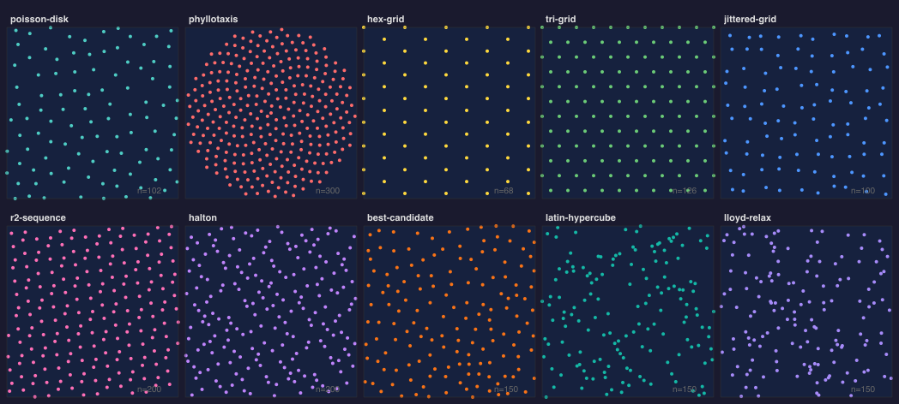
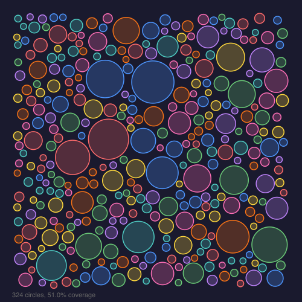

# @genart-dev/plugin-distribution

Distribution and packing plugin for [genart.dev](https://genart.dev) — spatial distribution algorithms (Poisson disk, phyllotaxis, hex grid, and more), circle/rect packing, growth simulations, and Wave Function Collapse tiling. Includes guide layers for non-destructive previews and MCP tools for AI-agent control.

Part of [genart.dev](https://genart.dev) — a generative art platform with an MCP server, desktop app, and IDE extensions.

## Examples



All 10 distribution algorithms side by side — from structured grids to quasi-random sequences.



Non-overlapping circle packing via trial-and-reject with variable radii.

## Install

```bash
npm install @genart-dev/plugin-distribution
```

## Usage

```typescript
import distributionPlugin from "@genart-dev/plugin-distribution";
import { createDefaultRegistry } from "@genart-dev/core";

const registry = createDefaultRegistry();
registry.registerPlugin(distributionPlugin);

// Or access individual exports
import {
  previewLayerType,
  voronoiLayerType,
  densityLayerType,
  distributionMcpTools,
} from "@genart-dev/plugin-distribution";
```

## Guide Layers

All three layer types are guide layers — they render overlays and can be cleared non-destructively.

### Distribution Preview (`distribution:preview`)

Renders generated points as colored dots.

| Property | Type | Default | Description |
|----------|------|---------|-------------|
| `algorithm` | string | `"poisson-disk"` | Algorithm name |
| `params` | string (JSON) | `"{}"` | Algorithm parameters |
| `dotSize` | number | `3` | Dot radius (0.5–20) |
| `dotColor` | color | `"#0088ff"` | Dot color |
| `opacity` | number | `0.6` | Overlay opacity (0–1) |

### Voronoi Overlay (`distribution:voronoi`)

Renders Voronoi cell edges from a point set.

| Property | Type | Default | Description |
|----------|------|---------|-------------|
| `strokeColor` | color | `"#333333"` | Edge color |
| `strokeWidth` | number | `1` | Edge width (0.5–5) |
| `fillColor` | color | `"transparent"` | Cell fill color |
| `opacity` | number | `0.7` | Overlay opacity (0–1) |

### Density Map (`distribution:density`)

Kernel density estimation heatmap with built-in colormaps (`viridis`, `plasma`, `inferno`, `hot`, `cool`).

| Property | Type | Default | Description |
|----------|------|---------|-------------|
| `radius` | number | `30` | Kernel radius (5–100) |
| `colormap` | string | `"viridis"` | Color map name |
| `opacity` | number | `0.65` | Overlay opacity (0–1) |

## Distribution Algorithms

| Algorithm | Key Parameters |
|-----------|----------------|
| `poisson-disk` | `minDist` (20), `maxAttempts` (30) |
| `phyllotaxis` | `count` (200), `scale` |
| `hex-grid` | `size` (20) |
| `tri-grid` | `size` (20) |
| `jittered-grid` | `size` (30), `jitter` (0.5) |
| `r2-sequence` | `count` (100) |
| `halton` | `count` (100) |
| `best-candidate` | `count` (100), `candidates` (10) |
| `latin-hypercube` | `count` (100) |
| `lloyd-relax` | `count` (100) |

All stochastic algorithms accept a `seed` parameter for reproducibility.

## MCP Tools (8)

| Tool | Description |
|------|-------------|
| `distribute_points` | Generate a spatial point distribution (10 algorithms) |
| `pack_circles` | Pack non-overlapping circles (trial-and-reject) |
| `pack_rects` | Pack rectangles into a bin (guillotine algorithm) |
| `preview_distribution` | Generate distribution and add a preview guide layer |
| `clear_distribution_preview` | Remove distribution guide layers |
| `grow_pattern` | Run a growth algorithm (DLA, differential growth, substrate) |
| `tile_region` | Tile a region using Wave Function Collapse |
| `distribute_along_path` | Distribute points along a polyline by arc-length |

## Related Packages

| Package | Purpose |
|---------|---------|
| [`@genart-dev/core`](https://github.com/genart-dev/core) | Plugin host, layer system (dependency) |
| [`@genart-dev/mcp-server`](https://github.com/genart-dev/mcp-server) | MCP server that surfaces plugin tools to AI agents |

## Support

Questions, bugs, or feedback — [support@genart.dev](mailto:support@genart.dev) or [open an issue](https://github.com/genart-dev/plugin-distribution/issues).

## License

MIT
